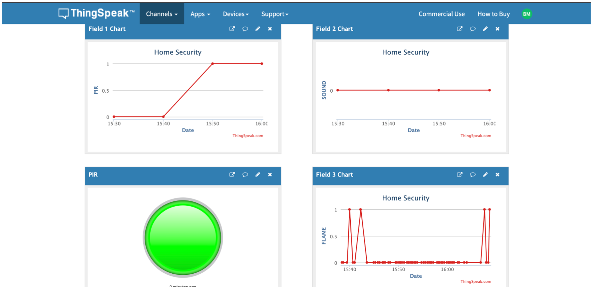
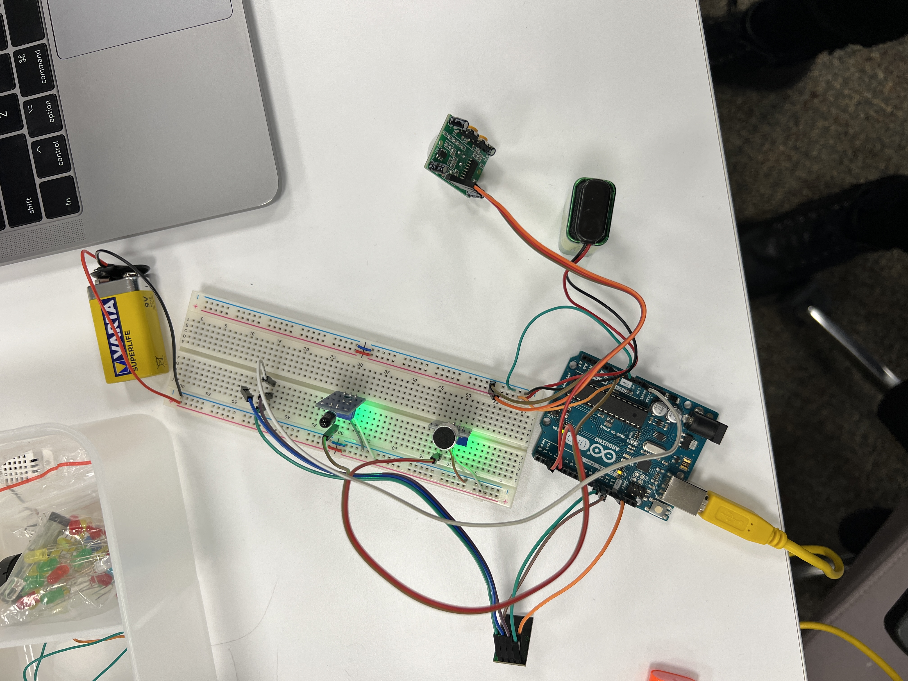
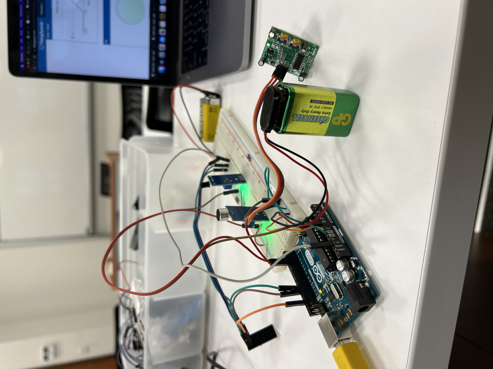
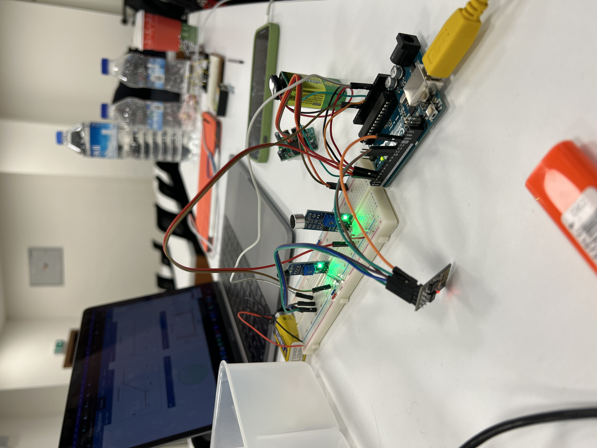
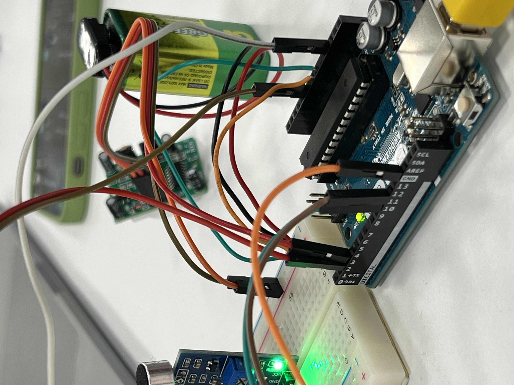
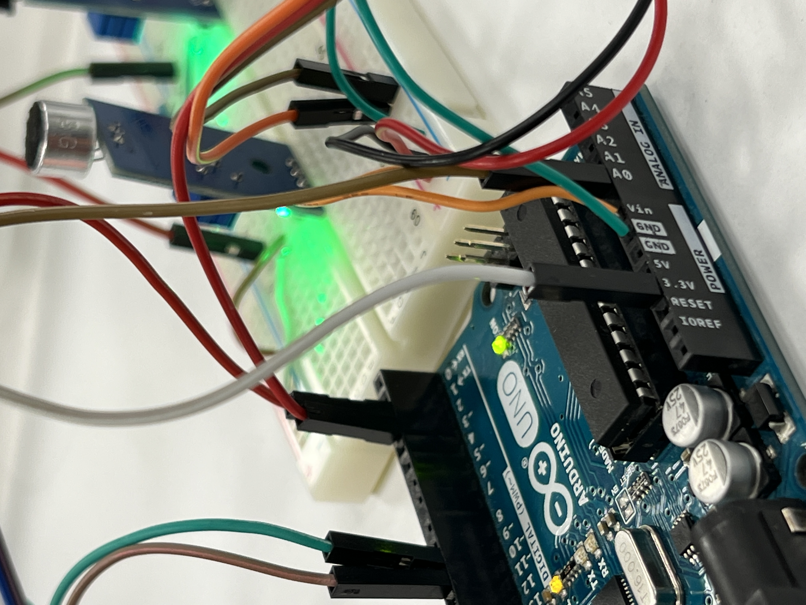

# Smart Home Security System

A smart home security system prototype using Arduino Uno with a flame sensor, Passive Infrared (PIR) sensor and a sound sensor to detect a fire and burglary, which sends notifications in these events over Wi-Fi. This project was made with one partner for my Sensors class during my Bachelor's.

## Table of Contents

- [Objective](#objective)
- [Description of Components](#description-of-components)
- [Data](#data)
- [Explanation of the Code](#explanation-of-the-code)
- [Conclusion](#conclusion)
- [Images](#images)
- [Credits](#credits)

## Objective

Smartphone technology is being used more and more as a way to communicate, and this technology isn't going away any time soon, either. Since the rise of social networking, smartphones have become an important part of our lives that we can't live without. Our lives have changed since the internet of things has introduced a new era where we can follow data provided by sensors. As a bonus, we can now control hardware like lights and fans. This study aims to design home security systems that keep a certain area safe from intruders and detect fire. The method is using a wifi module, a sound sensor, a Passive Infrared Sensor (PIR), and flame detectors to make the wireless home security technology work. This system uses the Internet of Things (IoT) concept to respond quickly if there is trespassing or fire. The wifi module sends an alert to the homeowner through a website that is part of the ThingSpeak system.
## Description of Components

### 1.1 Arduino Uno & ESP8266 Wifi Module
Arduino UNO is an open-source microcontroller board that may be used in a wide range of electronic applications at a reasonable cost. As an output, this board can operate relays, LEDs, servos, and motors and can communicate with other Arduino boards, Arduino shields, and Raspberry Pi boards.

Since Arduino UNO doesn’t have an embedded wifi module, we have connected ESP8266 wifi module to Arduino UNO. ESP8266 is a commonly used cheap module. An application can be hosted on the ESP8266, or Wi-Fi networking functionality can be implemented to another CPU.

### 1.2 Sound Sensor
Sound detection is one of the key aspects of the Home Security Systems that doesn’t include a camera. It is not easy to identify a detected sound as an emergency situation, so we combined our sound sensor with a Passive Infrared Sensor (PIR), used for movement detection.

This module is made up of two components: a capacitive microphone and an amplifier circuit. This module is capable of detecting ambient noise and produces analog output. You may change the sensor's sensitivity by adjusting the embedded potentiometer. It is a digital sensor.

### 1.3 Passive Infrared Sensor (PIR)
PIR modules contain a passive infrared sensor that identifies occupancy and movement based on the infrared generated by the human body. This module may be used in a variety of applications, including security, smart lighting, and automation. Although the market offers a variety of PIR modules, they are all essentially the same.

They all include a Vcc input, a GND output, and a digital output. A ball-like lens is mounted on the sensor in some of these modules to increase the viewing angle. The output of the PIR motion detection sensor may be directly attached to one of the digital pins of an Arduino. This pin value will be set to "1" if the sensor detects any motion. The two potentiometers on the PCB enable you to control the sensitivity and delay time after a movement is detected. These sensors require approximately 10–60 seconds to initialize and calibrate. This sensor is also digital.

### 1.4 Flame Sensor
The flame sensor's reaction is commonly utilized as a flame alarm since it is the most sensitive to ordinary light. This module is capable of detecting flames or wavelengths between 760 nm and 1100 nm. The IO port of a microcomputer can be directly linked to a small plate output interface and a single chip. To prevent sensor damage from high temperatures, a specified distance between the sensor and the flame should be maintained. The flame spectrum is highly sensitive since the detecting angle is 60 degrees. This is an analog sensor.

## Data

The Home Security System is based on three instant data streams: detection of movement, detection of sound, and detection of flame. Flame detection can be used alone to identify an emergency although sound detection and motion detection provides better results when they are combined. Motion and sound detection at the perimeter of the Home Security System can be identified as trespassing. Alone detection of motion or sound can be noises that affect the sensor's data.

### Motion Detection
When the PIR sensor captures the motion, first, it will print "Motion Detected!" to the serial monitor. Then its data will be packed with others by Arduino and it will be sent to the server of ThingSpeak by the ESP8266 module. After that, ThingSpeak displays a graph of captured data and turns the green LED on to show that motion is detected. After 15 seconds, Arduino will print "Motion Stopped!" to the serial monitor, the green LED will turn off, and PIR will calibrate itself again.

### Sound Detection
When the sound sensor detects sound, it immediately blinks its embedded LED synced with sound. Arduino prints "Sound On" to the serial monitor to show that sound is detected. Again, ThingSpeak provides a graph of our data. Our sound sensor provides 1 and 0 as data to show that there is sound or there isn’t sound.

### Flame Detection
When the flame sensor detects the flame, depending on the distance of the detected flame, Arduino will print "Close Fire" or "Distant Fire." Again, data is transmitted to ThingSpeak to be displayed as a graph.

The Home Security System managed to provide instant data from all three sensors without any interruption. We also had a chance to observe that data is transmitted by ESP8266 to ThingSpeak servers through the Hot Spot of a smartphone. Unfortunately, ThingSpeak works slowly to display the data instantly. We still managed to display some data on ThingSpeak after waiting for some time. The figure below provides the graphs and LEDs mentioned above.

### Power Circuit
Since three sensors and a wifi module required a lot of current to be drawn from the Arduino board, connecting every sensor in series and powering the board via USB would result in the sensors working improperly, or not working at all. To overcome this, after many experiments with trial and error, we decided that powering the PIR sensor with a 9V battery, the sound and flame sensors together with another battery, and the Arduino board and the wifi module via USB would be the most appropriate.

## Explanation of the Code

In order to make the wifi module communicate with ThingSpeak, we included the `SoftwareSerial.h` header file. We got two types of readings from the sound sensor: the first one being whether sound is detected or not, and the second one being the total amount of logic high values we get in a 10-second interval. To achieve the second one, we defined several millisecond variables for accurate calculation and a variable to store our total logic highs.

We set the network name and password to be a phone’s personal hotspot credentials so that the module can connect to it. We set different output states for each sensor that indicate whether they are triggered or not. For the ESP8266 NodeMCU module, we determined the Rx and Tx pins. These had to be different from the dedicated Rx and Tx pins on the board because otherwise the compiler would raise an error. We then set the dedicated readout pins for all of our sensors. We also gave the IP address for ThingSpeak so that the module can establish a connection. For the flame sensor, we set boundary values so that it wouldn’t yield any gibberish readings. Using the header file, we enable the Rx and Tx pins for the wifi module.

We start the serial monitor and initialize our digital sensors as inputs. Then, we implemented a series of checks to check whether the wifi module is connected and/or receiving commands or not. Inside our main loop, we use the header file once again to establish data communication over wifi using the function that takes the IP address that we gave earlier as well as the port number 80, which is typically used for communication over the wifi module.

For PIR sensor motion readings, we have two variables. One is for the reading we get and the other one is the state of the sensor. First, we check if the reading is logic low or high. If it is high, this means that there is motion. Now, we check the state of the sensor. If the state is low, this means that the sensor did not detect motion prior to this reading, so the motion has just begun. In this case, we print "motion detected" and change the state to high. However, if it is high, this means that the sensor was already detecting motion, meaning that the current reading is just the continuation of an ongoing movement, so we print nothing. After some motion, if the sensor reads logic low, we check the state. If the state is high, this concludes that there was movement but now it stopped, so we print "motion stopped" and change the state back to low.

For the sound sensor, we have found two ways of reading data: we printed the reading of regular detection of sound onto the serial monitor, while sending the total number of logic high values per 10 second intervals to ThingSpeak over the wifi module. For the first one, we just printed "sound on" for logic high readings and "sound off" for logic low readings. For the second one, we calculated the amount of time passed and when it reached 10 seconds, we reset. Within those 10 seconds, for each time we got a logic high, we increased the total amount and sent the value to ThingSpeak.

For the flame sensor, we set different ranges for different distances. When the fire was within 1.5 feet of the sensor, we printed "close fire" on the serial monitor. For fire between 1-3 feet, we printed "distant fire". For both of these cases, we changed the state variable to logic high. For no fire, we printed "no fire" and changed the value to low. We got readings every millisecond.

We packaged the data to be sent to ThingSpeak in JSON format. The API link and key were given in the ThingSpeak interface. By using the GET command, we commanded ThingSpeak to receive the packages. `Field1`, `field2`, and `field3` indicated our PIR, sound, and flame readings, respectively. We set the length of the data and gave a 2-second delay. Then, we sent our data and printed "data sent" as confirmation so we knew each time a package was being delivered. We sent data every second. After a package has been sent, we ended the connection and re-established it the next time the loop ran.

## Conclusion

In this project, we designed a home security system prototype which implemented IoT and different sensors. These sensors were a Passive Infrared (PIR) sensor, a sound sensor and a flame sensor. This way, we detected motion, fire and sound and sent our data over to a web interface using WiFi communication. Our prototype included an Arduino UNO microcontroller as well as an ESP8266 NodeMCU WiFi module. We learned how to use ThingSpeak, as well as Blynk thanks to our trial and error process. We also tried using a web-based interface to show our readings, but we changed our mind. One of the toughest challenges was forming the power circuit as three sensors and a wifi module required a lot of current supply, but we made it work in the end. We concluded our project with a working prototype at last.
## Images

### Circuit Photos:

The videos can be found in the images folder of this repository.
## Credits

Thanks to my good friend Berk for partnering up with me in this project.

The header file has been sourced from https://github.com/esp8266/Arduino/blob/master/libraries/ESP8266WiFi/src/ESP8266WiFi.h
